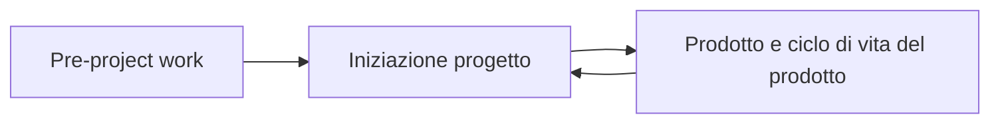
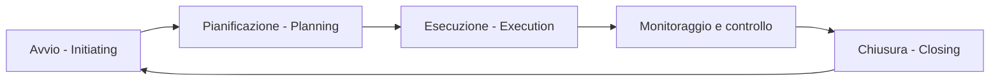
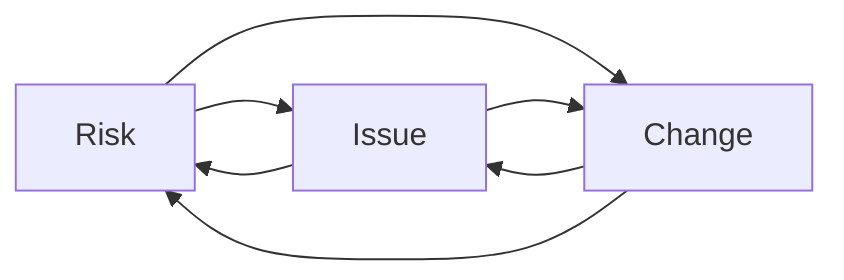
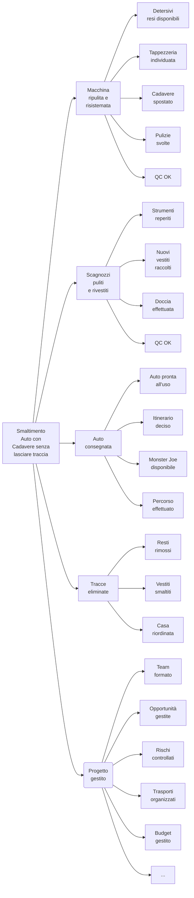
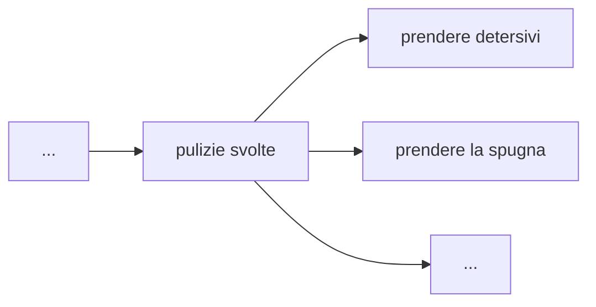

# Project Management

Referente per il corso: g.fachin@enaipfvg.it
Docente: Dalia Vodice (dalia.vodice@gmail.com) PM, Coach

Legge 4/2013. C'è una norma UNI per un registro, con esame, per diventare PM, associazione PMI (PM Institute) di Philadelphia, che accredita.  Seguiremo lo standard PMBOK (Project Management Body of Knowledge) che dà qualifica di PMP (Project Manager Professional)

### Expectation Alignment

S'è allestita una tabella. Ad ognuno è stato chiesto di scrivere su un post it con cosa ognuno si aspetta dall'insegnante. Serve ad evitare che alla fine qualcuno dica "mi aspettavo una cosa diversa" a fine progetto. $$\rightarrow$$ "*in / out of scope*". Vengono accettati o meno dallo speaker.

Dalia fa le sue richieste: trasparenza, sincerità, gruppo, condivisione tempestiva, e divertimento.

Ognuno dichiara infine cosa ognuno si aspetta dai colleghi, principalmente condivisione e interazione.

E' un ottimo strumento per iniziare un progetto, e minimizzare delusioni.

### Presentarsi come PM e tutelare le professionalità

A volte conviene presentarsi come PM, a volte dicendo "fornisco strumenti per lavorare meglio, in un modo più focalizzato verso un obiettivo.." e girarci intorno, se non c'è cultura aziendale di PM.

## Determinazione degli obiettivi

Alle olimpiadi,  cosa chiederà come obiettivo Usain Bolt? Almeno 2 ma meglio 4 medaglie? **Gold plating**: "mi hai detto 2 ma io te ne farò avere 4".  In questo modo ci sarà sempre disallineamento tra quello che vuole il cliente e quello che offri tu come PM. Se dobbiamo massimizzare un risultato, meglio decidere una soglia di accettabilità, sia come risultato sia come tempi o risorse. In caso di più scadenze possibili (piano A, piano B, ecc.), valutare se comunicare il worst case, e poi sorprendere.

La comunicazione, e gli stakeholder stessi sono delle risorse.  

## Caratteristiche di un progetto

*"Iniziativa temporanea, intrapresa per creare un prodotto, un servizio o un risultato con caratteristiche di unicità." (PMBok)*

* **Temporaneità**
* **Unicità** (nuovo, innovativo)
* **Elaborazione progressiva** (idea che viene cresce progressivamente, acquisisce conoscenza in fieri)

Un processo ha un **input**, che viene trasformato in un **output**. Di un progetto invece non si sa completamente all'inizio quale sarà l'input, e il modo con cui lo trasformeremo in output verrà adattato in corso d'opera. Non è routine, è *route*.

Un **programma** è un gruppo di progetti, sottoprogrammi e attività collegati e gestiti in modo coordinato al fine di ottenere benefici, non possibili tramite la gestione individuale di un singolo progetto.

Un **portfolio** è un insieme di programmi, progetti e operazioni per raggiungere obiettivi strategici.

### Complesso vs complicato

Complicato: *cum plica*, si piega e si ripiega fino a singoli componenti molto semplici.

Complesso: *cum plexus* (nodo). La difficoltà si osserva nell'interezza del sistema. Le relazioni tra i singoli elementi pesano di più dei singoli elementi.

La **complessità** di un progetto:

* è correlata alla sua **gestione**
* è relativa al suo **contenuto ** tecnico
* è legata alle **interrelazioni** e agli **impatti**.

## Il Project Management e il PM

Il Project Management è **un'applicazione** di *conoscenze, abilità, strumenti e tecniche*, per assicurare il **raggiungimento di obiettivi**, attraverso **la realizzazione** di deliverables che soddisfino le **esigenze** degli stakeholders. Senza la soddisfazione misurabile dell'esigenza il progetto, anche con le deliverables consegnate, non è proprio raggiunto.

Sta al PM scavare e fare sufficienti domande allo *sponsor* per capire. Anche la quantità di comunicazione e le soddisfazioni interpersonali sono da considerare. Il 90% del tempo del PM è devoluto in **comunicazione**, anche con strumenti, e la mancanza di comunicazione è uno dei principali fattori di fallimento di un progetto. 

Il Project Manager è chi viene **incaricato dall'organizzazione** di guidare il gruppo responsabile per il raggiungimento dagli obiettivi. Ha la responsabilità di **soddisfare le esigenze** delle attività, del gruppo e dei singoli obiettivi.

**Pro tip: se vieni nominato PM, fatti investire pubblicamente davanti a tutto il gruppo, per avere autorevolezza sufficiente a gestirli.**

Il PM lavora con il team e altri stakeholder. Bilancia

* capacità **tecniche**  di PM
* capacità **interpersonali** (soft skills, empatia)
* capacità **concettuali** (astrazione, immaginazione, visione strategica).

Il PM lavora sempre con vista a volo d'uccello. E' più importante la visione d'insieme che di dettaglio. A volte capita di dover anche fare delle cose. Bisogna farle con attenzione, isolando le attività in momenti separati dal lavoro da PM.

## Storia del Project Management

Nasce negli Stati Uniti tra gli anni '60 e la metà anni '80 in ambito aerospaziale, infrastrutture, e in ambito militare. Diventa poi trasversale fino agli inizi degli anni '90, e infine si orienta al business, fino ad oggi.

Progetto declina in inglese sia come "*project*" (gestione di una commessa) che come "*design*" (progettazione di un lato tecnico, es. impianto elettrico).

## Il PMO: Project Management Office

E' una **struttura organizzativa** che standardizza i processi di *governance* legati al progetto e facilita la condivisione delle risorse, metodologie, strumenti e tecniche.

# Il ciclo di vita del progetto

Il progetto è gestito con un **insieme di fasi**, sequenziali o in parte sovrapposte, che connettono l'inizio del progetto alla sua conclusione. Ogni fase raggruppa un **gruppo di attività**, concluso da un **processo decisionale (gate)** con il quale si passa al successivo.

Il pre-project work lo fa il **business analyst**. Una volta deciso e scelto parte il lavoro ed entra il PM (che spesso viene coinvolto anche prima). A fine progetto il prodotto viene gestito da un **product manager**. Eventuali evoluzioni sono gestite da ulteriori progetti.

### I cinque gruppi di processi del Project Management

### Avvio

* **Mappare** gli stakeholder
* Definire il **project charter**

In questa fase i costi effettivi sono bassi.

### Pianificazione

* Determinare l'ambito, sviluppar eobiettivi e risultati dell'ambito
* Definire le azioni necessarie a raggiungere gli obiettivi nei termini di tempo, risorse, costi equalità

Definiamo i dettagli, cosa va fatto (WBS, ecc). Definiamo il budget, assegnamo le responsabilità.  Definiamo gli indicatori di monitoraggio e controllo (KPI, Key Performance Indicators).

I costi iniziano ad aumentare, in modo non lineare.

#### Gantt vs Milestone plan

Evitare di mostrare i Gantt ai committenti, solitamente basta un piano delle milestone. I Gantt sono inutilmente complessi per i non operativi. In un piano delle milestone ogni milestone è un'attività a durata zero, puntiforme, a cui è associato un deliverable/output che deve essere fatto entro tale data. Non OGNI attività, solo quelle bottleneck. 

Il piano può cambiare in corso d'opera, ma bisogna ri-verificarlo contro tutti i requisiti e vincoli, rischi e conformità.

### Esecuzione

Si iniziano i lavori. Il costo esplode fino a plateau sigmoide.

### Monitoraggio e controllo

Verifica dei check point prestabiliti, delle metriche del caso. Evidenziare discordanze dal piano e definizione di azioni correttive.

### Chiusura

Celebration, raccolta risultati, rendicontazione, saldi, e **lesson learned**.

### Modifiche ad un progetto in corso

Le modifiche sono costosissime, per il progetto, e costano maggiormente più avanzata è la fase di esecuzione. Non si accettano le modifiche che non servono, ovvero che non aggiungono valore per il cliente o che non hanno senso. 

Ogni cambiamento impatta all'interno del triangolo **Issue-Risk-Change**. 

## Le dieci aree di conoscenza del Project Management

Ci sono 5 gruppi di processi, abbiamo visto.  Le dieci aree sono riflettori che lo illuminano da prospettive diverse, tenendolo sotto controllo. 

### Scope management

La prima area, l'ambito del progetto. Cosa dobbiamo fare? Cos'è *in scope* o *out of scope* (OoS)? 

### Project time management - Scheduling

Da quando a quando? Chi sta pensando ai tempi?

### Project cost management

Chi tiene sotto controllo il budget? quanto e come possiamo spendere? Flusso di cassa?

### Project quality management (quality = conformità)

Sarà conforme? In che modo? con che metriche e standard?

### Project resource management

Risorse umane, logistiche, fisiche. Persone, macchine, spazi.

### Project communication management

Chi parla? chi presenta? come ne parliamo? come comunichiamo tra noi?

### Project risk management

Che rischi corriamo? come vanno gestiti? I rischi sono sia negativi che positivi (quindi opportunità). 

### Project Procurement management

Acquisti, acquisizioni, cose da fare e in quali tempi

### Project stakeholder management

Tutte le relazioni con gli stakeholder

### Project integration management

Questo lo fa il PM: come integrare tutti gli altri 9 campi tra loro.

# Esercitazione 1:

Parliamo di gruppo di processi dell'avvio. La prima cosa è la mappatura degli stakeholder.  Gli stakeholder sono **individui, gruppi o organizzazioni** che possono **influenzare, essere influenzati o percepirsi interessati** da una decisione, attività o risultato del progetto, positivamente o negativamente.

Anche colleghi, competitor, enti, il pubblico, regione, stato, eccetera.

Come esercitazione, Dalia ci parla di una sua esperienza all'interno di grandi festival culturali in ambito storico, ed è stata chiamata per un festival vegetariano. In 5 anni si espande da festa da 5K persone fuori dalla ditta, fino a tutto Borgo Castello a Gorizia, fresco di ristrutturazione urbana.  Da 4 a 6 Luglio 2014 si è svolta la quinta edizione.

Noi, in quanto team, cerchiamo di identificare lo stakeholder. Lo sponsor sogna, il PM realizza, spesso imprecando nel processo. 

Il comune di Gorizia dice che i castellani non lo permetteranno mai, in quanto già ostili verso attività all'interno. Si propongono di fare le carte per la soprintendenza, e il comune dice che non serve, di glissare. Nonostante il consiglio, per evitare rischi, si decide di fare comunque tutto in regola con la soprintendenza.

Identifichiamo assieme gli stakeholder, scrivendo tutto su post-it.

3 giorni, conferenze scientifiche, ristorazione, spettacolo, espositori. Finanziamenti misti pubblici e privati. 

Assessore alla cultura, Polizia Municipale (comandante e vicecomandante), Vigili del Fuoco, Espositori (ditte), Allestitori stand, Castellani (subito sopra, vicini a breve raggio, residenti lontani), Ass. commercianti, Ristoratori, Area comunicazione del comune, Nostro ufficio stampa, Volontari, SIAE, Sponsor (MS) , PM, Team di PM, Consulenti esterni, Pulizie e disallestimento, Trasporti, Sicurezza, Sorveglianza, Partner Economici, Giornalisti, Media, e via a spacchettare uno per uno tutti i nominati (sindaco, dirigente, ufficio del dirigente), e frammentare il possibile.

Il secondo passo consiste nel disporre una matrice 2x2, su un asse l'interesse ( positivo e negativo) e sull'altro asse il potere (quanto possono aiutare o impedire il progetto), e dispongo i post it su dove mettere i post it in questo diagramma, alle giuste coordinate.

Si identificano quindi 5 livelli di coinvolgimento crescente in cui suddivdere tutti:

* unaware (U)
* resistant (R)
* neutral (N)
* supportive (S)
* leading (L)

Per ogni stakeholder si identifica il livello di coinvolgimento attuale (as is) e come lo vogliamo (desired).
Per esempio il main sponsor è L $$\rightarrow$$ L, mentre per i castellani vorremmo R $$\rightarrow$$ N almeno, così non fanno danni, mentre i volontari che arrivano.

Per il primo quadrante la prassi è "**manage closely**", marcare a uomo, se hanno tanto interesse e poco potere. Per chi ha tanto interesse e poco potere la prassi è "**keep informed**", far sapere le cose prima degli altri, perchè li mantiene S. Per chi ha molto potere e poco interesse "**keep satisfied**" , mantenere soddisfatto, vedere riconosciuti i loro ruoli e compiti e scopi. Capire cosa vogliono e darglielo. Chi ha poco potere e poco interesse, "**monitor**", vanno tenuti d'occhio, perchè potrebbero cambiare posizione.

Con i castellani, dovendo portarli a N, s'è dovuta definire una strategia. Una riunione preliminare con loro, prima del primo comunicato stampa del festival. Invitati tutti con letterina carina, firmata A MANO dallo sponsor, e consegnata a mano dalla PM.  Alla fine è venuta tanta gente, si è detto che si voleva fare il festival che sarebbe stata una rottura di scatole, ma si è cercato di dare cose in cambio, parcheggi alternativi, un numero telefonico dedicato per problemi e questioni personali, una navetta per turnisti, e poi si è ascoltato da loro in merito alle loro esigenze e problemi, garanzie in merito alle pulizie, ecc. Fino che la Farmacista si è proposta di mettere fiori sul davanzali, un prof ha messo a disposizione gli studenti, e così via. Sono passati da R a S senza passare per N. Si sono anche rivelati fonte di informazione locale, contatti, eccetera. 

Morale: se ti coccoli uno stakeholder puoi gestirlo.

**Ad ogni project meeting la mappatura andrebbe verificata, rivista, corretta. Se c'è gente nuova che arriva bisogna esserne consapevoli. Chiedere. Sempre. Aggiornare sempre il registro di stakeholder con la data dell'ultimo contatto. Eventualmente predisporre dei trigger per far sì che venga segnalata la mancanza di contatto periodico sufficiente e la strategia della gestione di quello stakeholder.**

Letture: "Il linguaggio del progetto" (Stefano Setti). In un banchetto di fate una fata arriva, ma non c'è posto per lei. La fata s'incavola, maledice Aurora e va via. E' uno stakeholder non identificato, non mappato, che arriva a gamba tesa a metà progetto, maledice e va via. 

Software utili: Microsoft Project, ProjectLibre, Primavera $$\leftarrow$$  software specifici per PM.

# Project charter

Prima di iniziare il progetto, si stabilisce la lista delle cose da fare. Ci sono un totale di 49 processi.  Assieme alla mappatura degli stakeholder, compone la fase di iniziazione. E' il documento sintetico che definisce il progetto.

Schematizzato in questo modo:

| Progetto               | <Titolo progetto>                                            |
| :--------------------- | :----------------------------------------------------------- |
| Mission                | Creazione di.. consentirà di.... Scopo totale del progetto, il problema che vuole risolvere. |
| Obiettivi              | Qualcosa a cui è indirizzato il lavoro, una posizione da guadagnare, uno scopo da raggiungere, un risultato da ottenere, un prodotto da creare, un servizio da fornire. SMART (Specific-Measurable-Achievable?-Relevant-Timely) |
| Deliverable            | Qualsiasi prodotto, risultato o capacità di fornire un servizio, univoco e verificabile, che deve essere realizzato per portare a termine un processo, una fase o un progetto. Solitamente deve essere approvato dallo sponsor/cliente. |
| Esclusioni             | Cosa è escluso dal progetto                                  |
| Stakeholder            | Sponsor, PM, Team, Iniziatore, Consulenti, altri stakeholder |
| Ruoli e responsabilità | Sponsor (persona o gruppo che fornisce le risorse finanziarie al progetto), PM (responsabile dell'utilizzo delle risorse al fine di ottnere gli obiettivi del progetto), Consulenti (risorse umane con competenze tecniche specifiche che possono essere consultate dal PM per aver consigli sullo sviluppo del progetto) |
| Vincoli                | Restrizioni e limitazioni. Fattori esterni, leggi, standard da rispettare, scadenze temporali, disponibilità di materie prime. |
| Assunti                | Presupposti, presunzioni e fattori che vengono ritenuti veri, reali o certi anche se non si dispone di prove o dimostrazioni. Sono molto pericolose, se vengono lasciate non verificate. |
| Milestone              | (M1, M2, M3.. ) Date a cui sono associati: Avvio, Kick off meeting, verifica intermedia, risultato del progetto entro... , lesson learned. |
| Rischi                 | (R1, R2...) Elenco rischi individuati all'inizio del progetto |
| Opportunità            | (O1, O2...) Elenco opportunità individuate all'inizio del progetto |
| Firme per accettazione | Data, e firme di Project Manager e Sponsor                   |
| (opz.) Budget          | Stima dell'ordine di grandezza o range di costi              |

*"Il Project Management è buon senso applicato." - Dalia*

Nella fase di charter i dati non saranno ancora mai completi e definiti nel dettaglio. Vanno indicati solo, a grandi linee, le informazioni disponibili a priori.

Nota: per l'europrogettazione si lavora in due fasi:il primo charter include il partecipare e vincere il bando. Chiuso questo progetto, nel caso venga vinto, si creerà un secondo charter per l'esecuzione del progetto vinto.

## Project Charter

| Progetto               | Smaltimento cadaveri                                         |
| :--------------------- | :----------------------------------------------------------- |
| Mission                | Escludere i due protagonisti dal qualsiasi conseguenza derivante dall'esecuzione. ( E invece la mission è "Preservare la famiglia mafiosa." La mission è sempre alta, è un principio.) |
| Obiettivi              | Il corpo è eliminato, e nessuno viene arrestato o incriminato per l'omicidio. (Invece: "Far sparire un'auto con un cadavere, senza lasciare tracce e senza farsi scoprire, lasciando casa entro l'ora X.") |
| Deliverable            | Valutazione problema e visione auto e relativi problemi. Tranquillizzare i presenti. Eliminazione corpo. Pulizia macchine. Assegnazione ruoli e scadenze. Vestiti e puliti? (Invece: Prima fase: pulire la macchina.  Seconda fase: pulire i due ed eliminare i vestiti insanguinati. Terza fase: arrivati fino allo sfasciacarrozze dopo aver determinato la strada.) |
| Esclusioni             | Assistenza psicologica ai presenti. Biancheria di ricambio. Escluse le pulizie di fino. Trasferimento al ritorno. |
| Stakeholder            | Nomi dei presenti. Si presenta con tutti. Bonnie, che deve essere soddisfatta. Marcellus Wallace, i tre presenti. La polizia. Wolf. Lo sfasciacarrozze. I partecipanti della festa da cui vengono tutti. I vicini di casa. Netturbini (che non vedono i vestiti insanguinati). |
| Ruoli e responsabilità | Ognuno deve fare il suo dovere come un orologio. Chi pulisce l'auto, chi trova coperte, chi porta caffè. Chi guida quale macchina fino al percorso, e cosa fare in caso di pattuglia. Monster Joe e Raquel (Fornitori esterni, ma nel team). |
| Vincoli                | 9.30: Tempo di ritorno a casa di Bonnie. Lasciare la casa pulita. |
| Assunti                | La macchina è funzionante in modo impeccabile (Invece: che gli altri abbiano detto la verità quando si informa. Assume che troverà di detersivi ("La casa sembra in ordine, assumo che ci siano detersivi") Tutti collaboreranno in modo impeccabile. Assume che siano già stati in carcere. |
| MilestoneClosing       | M0: Telefonata: arrivare a casa entro 30 minuti. "Ce ne metterò dieci." (Gold plating!).   M1: si presenta a casa: 8.40 M2: auto pulita: 9.10 M3: fuori di casa: 9.30  |
| Rischi                 | L'auto si ferma per strada(Mitigato da "Si informa sulle condizioni dell'auto").  Un poliziotto che guarda dentro l'auto dopo averli fermati. (Mitigato da "Dare istruzioni precise.")  Il fornitore Monster Joe è chiuso (Mitigato da "Chiama prima.") Insubordinazione dei due (Mitigato da "Comunicazione assertiva e autoritaria") Parlare in fretta, e non farsi comprendere. |
| Opportunità            | Colazione con Raquel a fine del tutto.                       |

**Scope:** Wolf fa solamente cose pertinenti allo scope. Sta mezzo metro indietro, disponendo e non eseguendo.

**Schedule:** Guarda l'orologio e aggiorna tutti sui tempi.

**Costs:** caso un po' particolare, diciamo budget illimitato

**Quality:** controlla la qualità delle pulizie e la conformità

**Resource:** gli è chiaro chi ha davanti, in che condizioni sono, e di chi avrà bisogno

**Procurement:** assume che ci siano una serie di oggetti (detersivi), correndo un rischio.

**Risk: ** mette in pista tutte le azioni possibili per mitigare i rischi, in primis chiedendo.

**Communication:** stile di comunicazione imperativo, aggiorna tutti su tempi e risultati, garantendosi il controllo della situazione necessario. La comunicazione è sempre tempestiva, e personalizzata. Ci sono rassicurazioni. Non dice tutto a tutti. Jimmy manca in alcuni momenti (la strada da percorrere, per es.). Apprezza quando qualcuno fa un buon lavoro.  Fornisce sempre la motivazione di ogni ordine quand'è necessario. Verifica che i suoi ordini siano compresi.

**Stakeholder:** tutti gestiti e presi in considerazione.

**Resources:** un team ha 5 fasi:

* **forming** (tutto sarà bellissimo)
* **storming** (iniziano le magagne, litigi, conflitti e discussioni) da cui si esce con il
* **norming**: ci diamo delle regole condivise, con lo scopo di restare più possibile nel 
* **performing**,  in cui si lavora al meglio, per finire con
* **adjourning**, a fine.

*Pro tip: anticipare prima possibile il norming, per limitare le secche dello storming. Prima lo si fa e meglio è, perchè si possono inserire regole più solide nella fase di forming. Chi fa cosa, come risolveremo i conflitti, chi fa meglio cosa, se ci sono facilitatori, se un membro viene meno ad un suo compito, ecc.*

Ma sopra tutto: **Integration:** Fa il project manager. Dispone, controlla, motiva, ispira, ribadisce, spiega. Dà informazioni. Mette pressione.

### Le 5 fasi del life cycle.

* **Initiation**: la telefonata con cui Wallace lo chiama.
* **Pianificazione**: mentre arriva in macchina, a cui segue il suo arrivo a casa ovvero il kick off meeting. E' già preparato sulla situazione e ha un piano.
* **Esecuzione**, in cui vengono svolti i lavori.
* **Monitoraggio e controllo**: costante flusso di domande, e verifiche.
* **Closing**: alla fine.

*pro tip: non innamoratevi mai della vostra idea come PM. Siate sempre pronti a spostarvi di prospettiva, e vedere la cosa da altri punti di vista. Siate pronti a cambiarla.*

# Pianificazione

Il primo strumento non è un quando, ma un cosa. E' il **Work Breakdown Structure (WBS)**.  Conviene sempre aggiungere un deliverable "Progetto gestito". Sotto il titolo c'è il livello dei **deliverable**. Al livello sottostante, ci sono i **Work Packages**. Deve assolutamente contenere il 100% del lavoro da fare, ovvero tutto ciò che è in scope. Se non è in WBS, non va fatto. Non è importante la dimensione temporale, per ora. Il QC viene sempre fatto da altre persone (sponsor, ecc),e non da chi ha svolto il lavoro, in teoria.

### Work Breakdown Structure per mr. Wolf:

Ogni work package va poi scomposto a piacere in attività (verbi all'infinito) con l'esploso delle cose da fare. Un WP è solitamente assegnabile ad una persona. Esplodere un WP vuol dire definire le attività:

Si possono svolgere in modo **deliverable oriented** oppure  **phase oriented**. 

Come verifica si può rimuovere il nome del progetto, chiamare qualcuno e chiedere di cos'è la WBS: dovrebbe risultare intuitivo capire quale sarà il risultato leggendo il resto del diagramma. La WBS è considerata uno strumento tecnico e di comunicazione: una WBS parla, può essere mostrata ad uno sponsor per verificare che ci sia tutto, può essere usate per cronoprogrammi un po' più snelli. 

*pro tip: tenere sott'occhio le cose: alcuni programmi hanno dashboard per visibilità simultanea. Altri strumenti conviene tenerli a muro e guardarli sempre.*

## Lesson Learned

Lezioni imparate, vanno stilate sempre a fine progetto. Distillano la conoscenza acquisita, per evitare di ripetere in futuro gli stessi errori.

* cos'abbiamo fatto bene, e perciò rifaremo? (analisi del video, lavagna recuperata, collaborazione incentivata tra team...)
* cosa potevamo fare meglio o diversamente? (potevamo verificare prima che ci fossero i materiali per scrivere, fogli e pennarelli; condividere di più le rispettive diverse esperienze; condividere prima materiale corso

*pro tip: far facilitare la lesson learned a qualcun altro del team, per evitare di mettere in soggezione qualcuno del team.*

Si possono poi aggiungere altre domande a piacere. Esiste poi una modalità retrospettiva, propria dei metodi *agile*.

